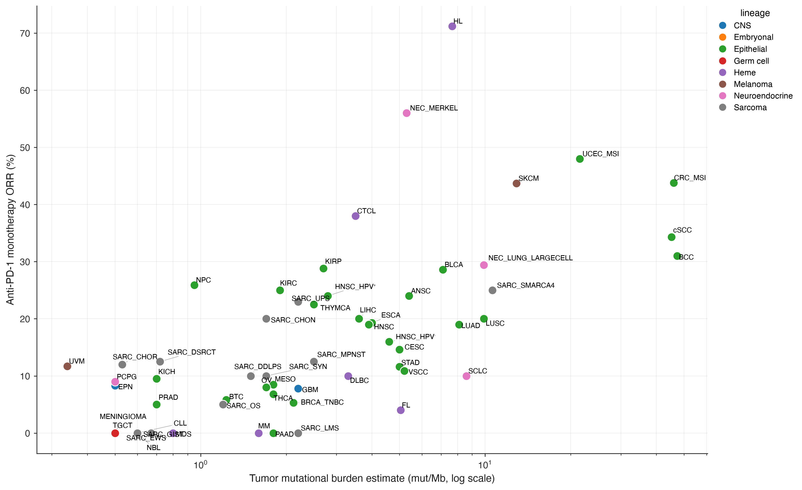

# Receptor-defined TNBC and PAM50 basal-like breast cancer

Issue [#540](https://github.com/pirl-unc/oncoref/issues/540), reviewed 2026-09-23.

`BRCA_TNBC` is a receptor-defined subtype of `BRCA`. `BRCA_Basal` remains the
PAM50 basal-like expression subtype. They overlap; neither is an alias for the
other. Do not sum their counts. They retain the same physical Treehouse sample
namespace, so a shared tumor cannot become an independent training/validation
sample merely by appearing in another subtype.

## Selection and missingness

The builder uses the released, checksum-pinned BRCA raw matrix from
`source-v5.22.10` (34,571 genes, 1,099 columns). It copies whole sample columns;
it does not filter genes, alter values, or renormalize a partial transcriptome.
Clinical metadata come from the `brca_tcga` patient table at cBioPortal datahub
revision `0cc9138746c08b304f8dac92c31983e0ef44af1d`. The
[build manifest](brca-tnbc-build.json) records every input URL and SHA-256.

1. Join exact patient barcodes to `ER_STATUS_BY_IHC`, `PR_STATUS_BY_IHC`,
   `IHC_HER2`, and `HER2_FISH_STATUS`. Reject duplicate patient metadata or
   malformed/duplicate expression sample IDs.
2. Definite FISH resolves missing, equivocal, or indeterminate HER2 IHC.
   Opposing definite IHC/FISH calls leave HER2 indeterminate. Without definite
   FISH, retain a definite IHC call.
3. Any definite positive receptor establishes `non_TNBC`. Otherwise require
   three explicit negatives for `TNBC`; unresolved cases remain `indeterminate`.
   Preserve raw fields and HER2 conflict flags even if positive ER/PR already
   establishes non-TNBC status.
4. Select only primary tumors (sample-type barcode `01`) called TNBC, with one
   sample per patient. Preserve excluded samples and reasons. PAM50 never
   participates in selection.

These are historical categorical calls. We do not retrospectively apply modern
positivity thresholds to coarse percentage bins, infer receptors from RNA or
amplification proxies, or substitute follow-up-neoplasm fields.

The [membership audit](brca-receptor-membership.csv) retains all 1,099 parent
columns: 1,092 primary tumors and seven excluded metastatic samples. Primary
cases comprise 157 TNBC, 858 non-TNBC, and 77 indeterminate. All 157 selected
tumors pass `sample_expression_qc_v3`; no QC fallback is used.

## Observed overlap

PAM50 annotations come independently from the pinned
`brca_tcga_pan_can_atlas_2018` patient table. The primary-tumor cross-tabulation
is also supplied as [CSV](brca-tnbc-pam50-overlap.csv).

| PAM50 call | TNBC | Non-TNBC | Indeterminate |
| --- | ---: | ---: | ---: |
| Basal-like | 115 | 33 | 23 |
| HER2-enriched | 12 | 56 | 9 |
| Luminal A | 4 | 472 | 22 |
| Luminal B | 1 | 183 | 13 |
| Normal-like | 9 | 22 | 4 |
| Unavailable | 16 | 92 | 6 |

Of the 141 TNBC tumors with PAM50 calls, 115 (81.6%) are basal-like and 26
(18.4%) are other subtypes. The 171 primary basal-like tumors include 115 TNBC,
33 non-TNBC, and 23 indeterminate cases. The existing 172-column basal matrix
also contains one metastatic sample; that independently defined cohort is not
rebuilt here. These are policy-specific cohort counts, not population prevalence.
The distinction agrees with the primary molecular analysis by
[Prat et al.](https://pmc.ncbi.nlm.nih.gov/articles/PMC3579595/), which identifies
both basal-like and non-basal-like disease within receptor-defined TNBC.

## Response evidence and TMB

The PD-1 anchor (5.3%, KEYNOTE-086 cohort A), PD-L1 anchor (10.0%, PCD4989g),
compatibility PD-1 row, and all 19 endpoint records now use `BRCA_TNBC`.
Endpoint IDs, denominators, estimates, confidence intervals, treatment-line
labels, and source locators are preserved.

- [KEYNOTE-086 cohort A, PMID 30475950](https://pubmed.ncbi.nlm.nih.gov/30475950/)
  enrolled 170 patients with previously treated metastatic TNBC, not
  PAM50-selected basal-like disease.
- [KEYNOTE-086 cohort B, PMID 30475947](https://pubmed.ncbi.nlm.nih.gov/30475947/)
  concerns previously untreated, PD-L1-positive metastatic TNBC; its alternate
  evidence remains distinct from cohort A.
- [PCD4989g, PMID 30242306](https://pmc.ncbi.nlm.nih.gov/articles/PMC6439773/)
  evaluated atezolizumab monotherapy in metastatic TNBC; treatment-line and
  PD-L1 subsets retain their own endpoint records.

`BRCA_Basal` now has an explicit response gap:
`tnbc_trials_do_not_estimate_pam50_basal_response`. `BRCA` retains its aggregate
gap. A plotting join therefore cannot attach TNBC response to basal-like TMB.

New TNBC TMB uses portal `TMB_NONSYNONYMOUS` from the pinned PanCancer Atlas
sample table, restricted to the exact primary RNA sample IDs and
`cases_sequenced` eligibility. The [TMB audit](brca-tnbc-tmb.csv) retains all
157 selected tumors: 156 have eligible rates and one lacks a mutation profile.
The median is 2.1166666665 and mean 3.2854700855 mutations/Mb (curated as 2.12
and 3.29). This is a portal-rate reanalysis, not a subgroup median published in
[the TCGA PanCancer paper](https://pubmed.ncbi.nlm.nih.gov/29625048/) or an
independent reconstruction of callable bases. Confidence remains low. Existing
basal-like TMB remains flagged for source review.

TCGA expression/TMB describe primary tumors; response evidence comes from
different patients with metastatic disease and trial-specific treatment/PD-L1
eligibility. Correcting the subtype does not make those cohorts matched or
justify patient-level prediction from the scatter.

## Reproduction and artifacts

From the repository root with dependencies installed:

```sh
mkdir -p /tmp/brca-tnbc/sources
curl -fL https://github.com/pirl-unc/oncoref/releases/download/source-v5.22.10/BRCA_per_sample_tpm.parquet \
  -o /tmp/brca-tnbc/sources/BRCA.parquet
python scripts/build_brca_tnbc.py \
  --brca-matrix /tmp/brca-tnbc/sources/BRCA.parquet \
  --source-dir /tmp/brca-tnbc/sources --download-sources \
  --output-dir /tmp/brca-tnbc/cache/treehouse-polya-25-01-tcga-brca-tnbc
python scripts/rebuild_expression_artifacts.py \
  --cache /tmp/brca-tnbc/cache --ref /path/to/base/cancer-reference-expression-percentiles \
  --out /tmp/brca-tnbc/rebuild
python scripts/merge_expression_artifact_rebuild.py /path/to/complete-bundle /tmp/brca-tnbc/rebuild
python scripts/generate_reference_availability.py \
  /path/to/complete-bundle/cancer-reference-expression \
  --output /tmp/brca-tnbc/reference-availability.csv
```

Use a **copy** of the complete base bundle for the merge. No baseline TNBC
percentile shard is required. The focused rebuild emits raw/clean summaries,
gene and CTA-proteoform percentiles, within-sample distributions, five
representatives, and QC/partition/build provenance. Full-transcriptome clean-TPM
normalization precedes biological-gene filtering. The merge recomputes partitions across all cohorts so shared tumors have one
role. In this release existing roles are unchanged; TNBC also retains the
metaplastic tumor's existing audit-only adjudication.

Raw matrix: `source-v5.22.14`. Derived bundle: `v5.23.25`, an overlay on
`v5.23.24`. Other raw matrices retain their individual release pins. Response
plots can be regenerated with `oncoref.plots.apd1_vs_tmb` and `apd1_orr_bars`
for both `strict_pd1=True` and `False`, and `ici_response_by_regimen`.
The regression test inspects plotted data and requires the TNBC point to be
`(2.12, 5.3)`, with no basal-like point.

Regenerated strict PD-1 response/TMB panel (TNBC at 2.12 mutations/Mb, 5.3% ORR):


