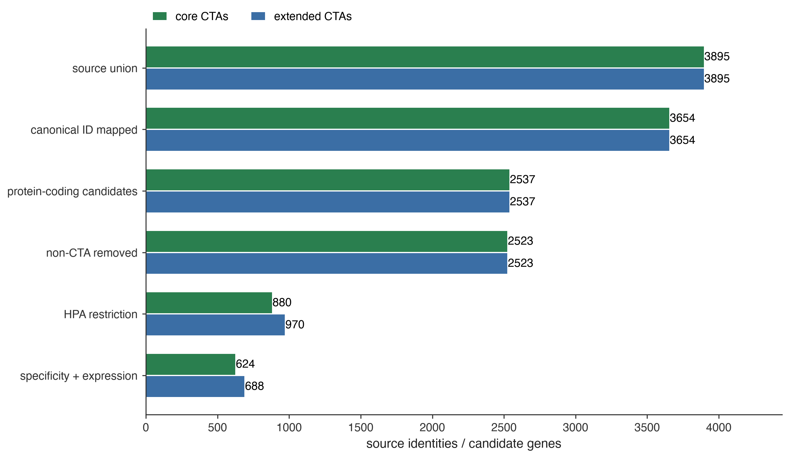

# Core and extended reproductive CTA curation

[All figures, vector PDF](oncoref-cta-landscape-figures.pdf)

Core: 624 genes. Extended: 688 genes.

[Core figures and audits](core/index.md) · [Extended figures and audits](extended/index.md)

[Gene-level comparison](cta-panel-comparison.csv) · [Vector comparison](cta-panel-comparison.pdf)

