# CTA landscape figures — September 24, 2026

[All 11 figures, vector PDF](oncoref-cta-landscape-figures.pdf) · [Source definitions and reproduction](../../cta-landscape-sources.md)

2,499 coding candidates; 624 retained by the default rules. The complete source union includes 2,842 distinct mapped or unresolved identities. All 297 prior default genes remain.

[Pooled funnel counts](cta-stage-counts.csv) · [Publication-specific counts](cta-publication-intake-counts.csv) · [Source overlaps](cta-source-overlap-counts.csv)

Source sets overlap and are not independent validations. Figures distinguish nomination, HPA restriction and final-panel admission. The full generated run also includes gene-level membership and candidate/default tables.

## Stage Funnel

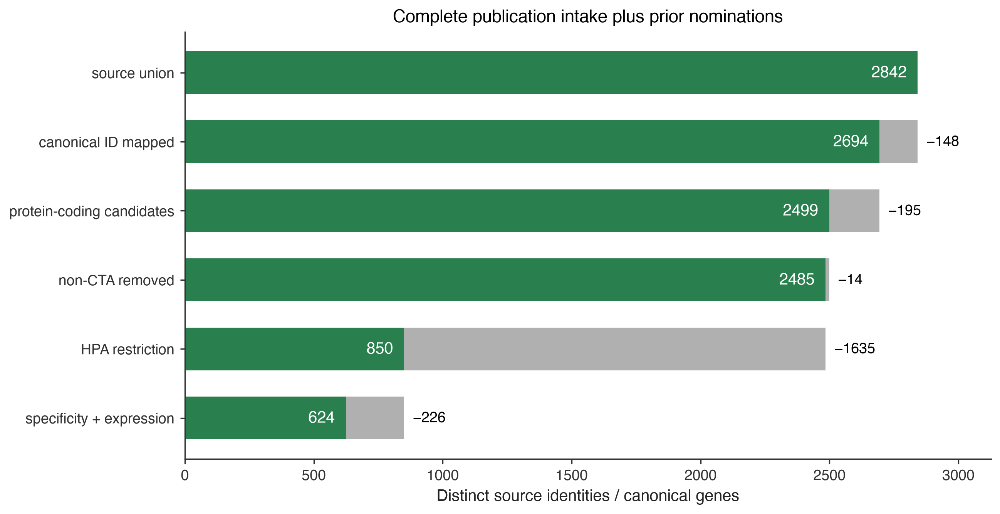

## Filter Outcome

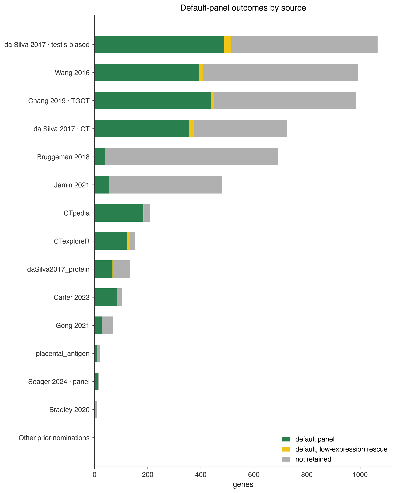

## Source Overlap

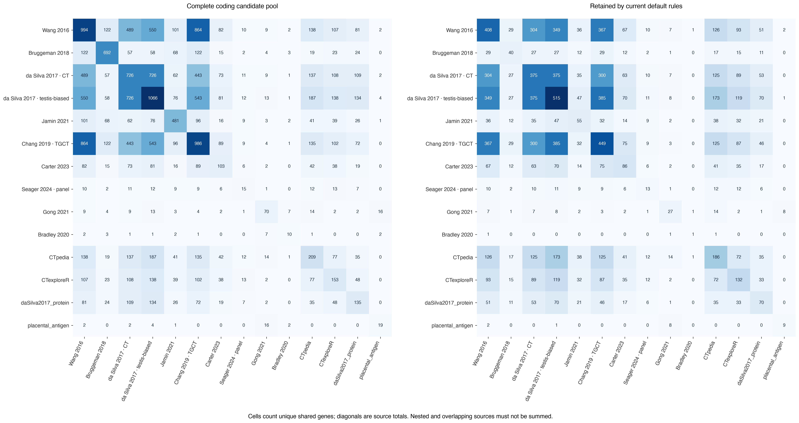

## Filter Funnel

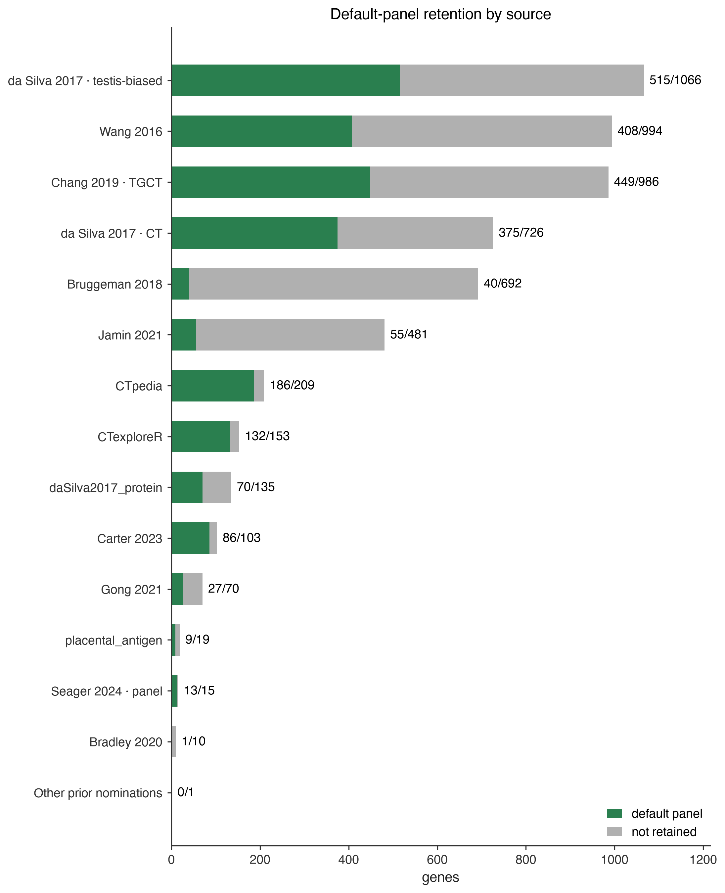

## Protein Vs Rna

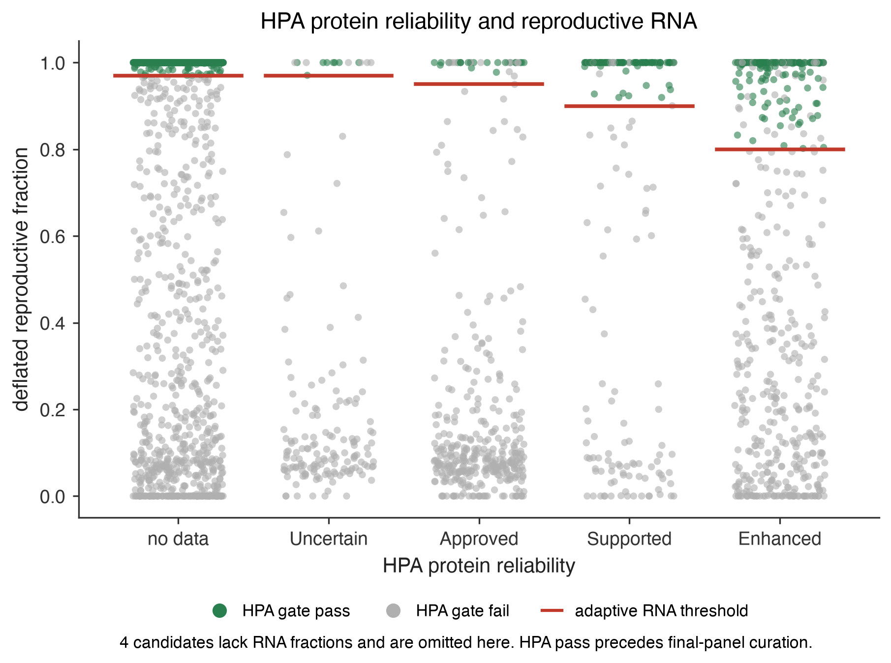

## Placental Source Overlap

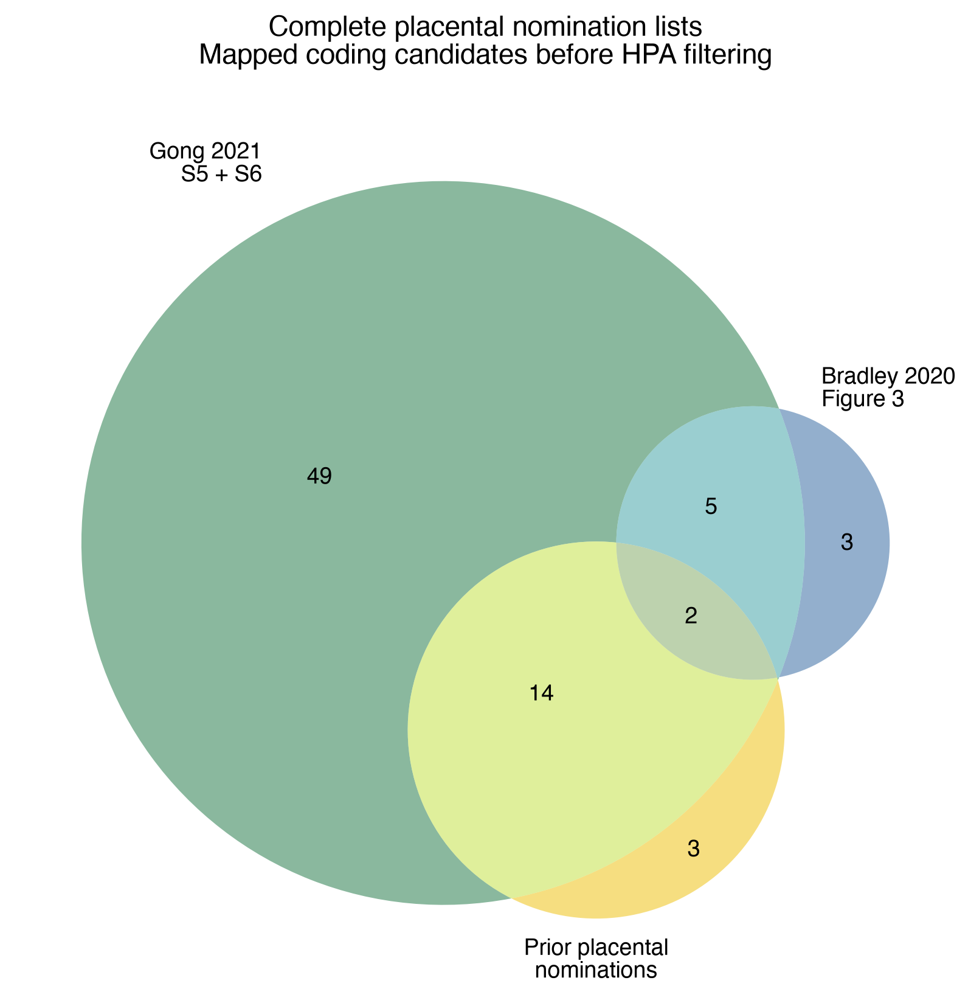

## Source Venn

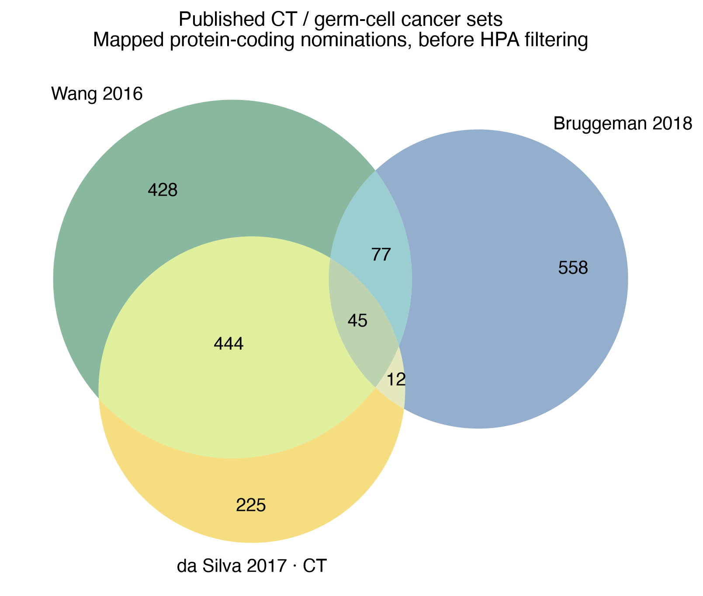

## Legacy Source Venn

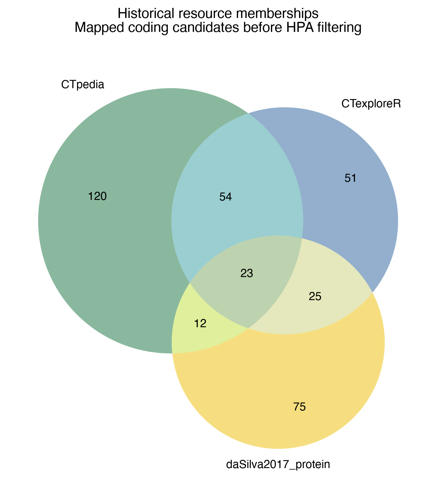

## Deflated Frac Dist

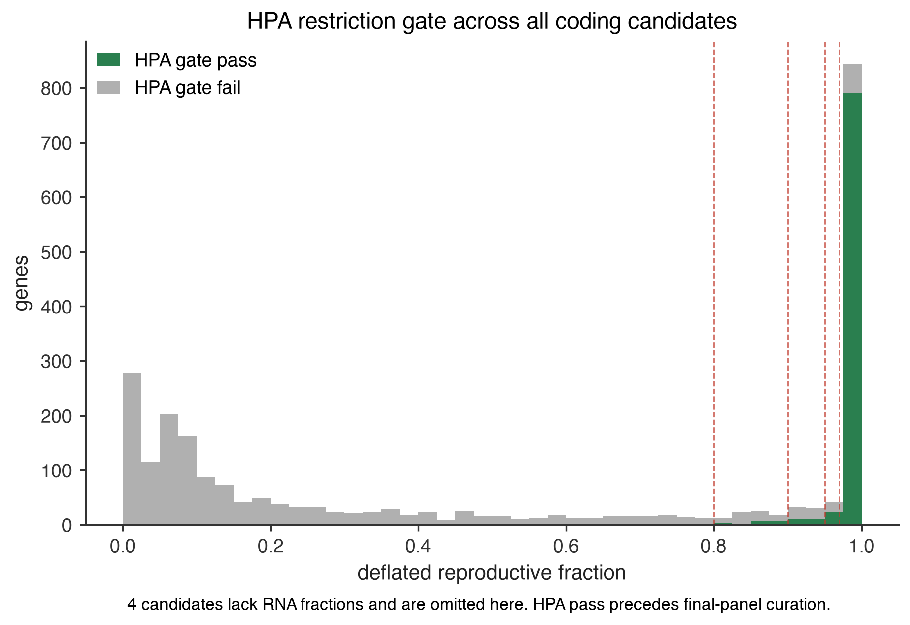

## Landscape Source Venn

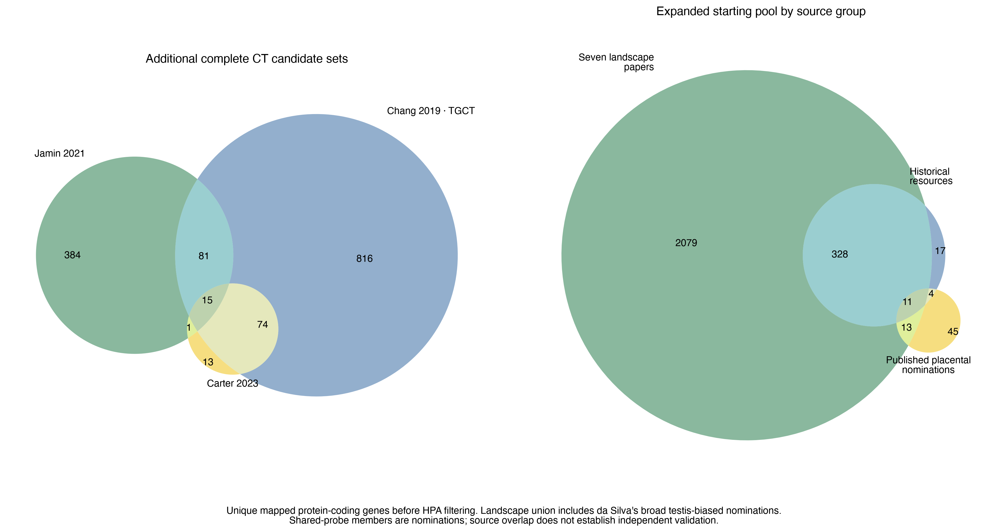

## Publication Funnel

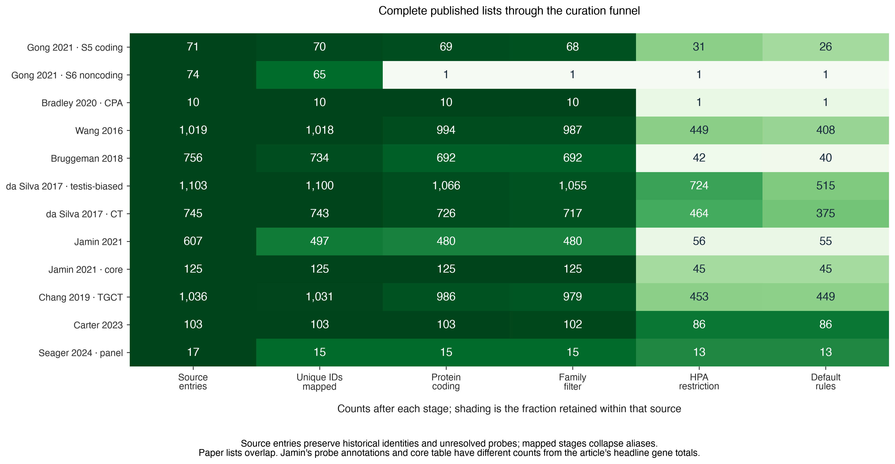
