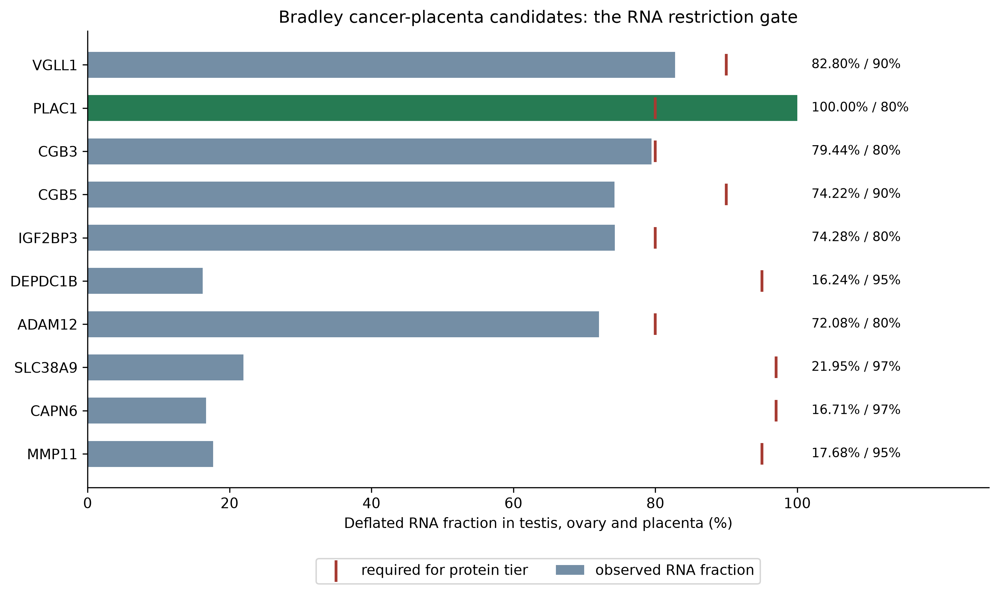
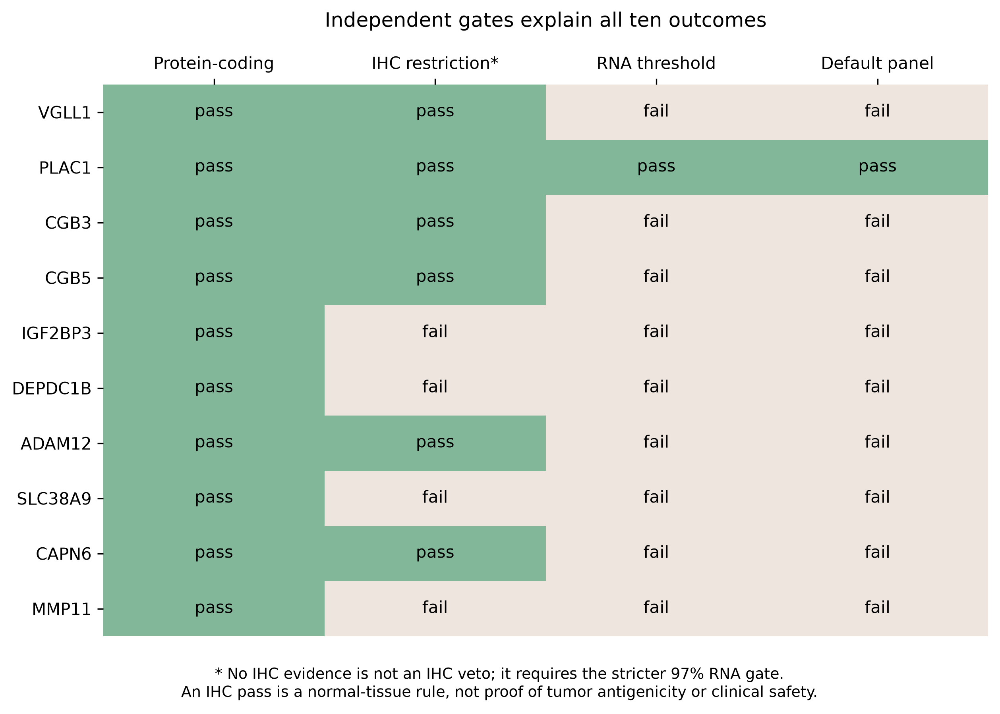
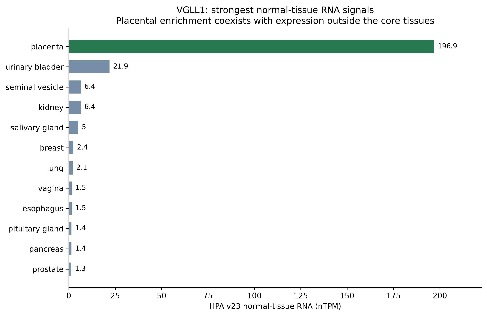

# Bradley cancer-placenta candidates: normal-tissue gate audit

[Bradley et al. 2020](https://doi.org/10.1038/s41467-020-19141-w) provides a
cancer-placenta nomination list and HLA-A*01:01 peptide/T-cell evidence for VGLL1.
Oncoref's default answers a separate question: whether current normal-tissue
RNA/IHC meets the reproductive-restriction and specificity rules.

## Results

| Gene | HPA deflated RNA fraction | Required | IHC restriction gate | Default |
|---|---:|---:|---|---|
| VGLL1 | 82.80% | 90% | Pass | Excluded |
| PLAC1 | 100.00% | 80% | Pass | Retained |
| CGB3 | 79.44% | 80% | Pass | Excluded |
| CGB5 | 74.22% | 90% | Pass | Excluded |
| IGF2BP3 | 74.28% | 80% | Fail | Excluded |
| DEPDC1B | 16.24% | 95% | Fail | Excluded |
| ADAM12 | 72.08% | 80% | Pass | Excluded |
| SLC38A9 | 21.95% | 97% | Fail | Excluded |
| CAPN6 | 16.71% | 97% | No IHC; no veto | Excluded |
| MMP11 | 17.68% | 95% | Fail | Excluded |

All nine exclusions fail the RNA gate. Four additionally fail IHC restriction.
CAPN6 has no IHC evidence, so the stricter missing-protein RNA threshold applies.
The matrix marks that cell as grey “no IHC”, separately from a measured IHC pass.
No Bradley candidate is removed only by the later default specificity step.
No thresholds or candidate membership were changed by this audit.




## Why VGLL1 remains a candidate

VGLL1 has **Supported** normal-tissue IHC reliability and passes the IHC tissue
rule, but its 0.8280 deflated RNA fraction fails the required 0.90. HPA v23 has
placenta RNA at **196.9 nTPM** and urinary bladder at **21.9 nTPM**, with further
expression outside the three core tissues. These are HPA consensus nTPM values,
not the paper's GTEx TPM values; their numbers should not be interchanged.

The paper divides normal tissues by risk category and experimentally tests
primary cells. Its Figure 6 reports recognition of primary mammary cells and
low bladder-cell recognition at the highest effector:target ratio, alongside
lack of recognition in the tested lung-airway cells. This supports recording
VGLL1 tumor antigenicity while retaining the normal-tissue caveat. It does not
establish clinical safety across all tissues or patients.



## Tissue scopes and the display correction

The deflated RNA numerator uses **testis, ovary and placenta**; thymus is omitted
from the denominator. The IHC allowed-tissue rule and the `rna_max_somatic_*`
annotation use broader reproductive-tissue scopes, including accessory tissues
and breast. They are not interchangeable with that RNA numerator. The maximum
somatic field therefore does not enumerate every contributor to RNA-gate
failure. The exported full normal-tissue observations make those contributors
reviewable. Antibody reliability is not evidence that every paralog is resolved.

The audit found a figure-label bug: curation plots had displayed **98%** for
Uncertain/missing protein, while `HPA_ADAPTIVE_PROTEIN_RNA_THRESHOLDS` and the
actual filter use **97%**. Plot thresholds now derive from that owner constant;
regression tests require agreement. This corrects the display without relaxing
the filter.

## Reproduction and machine-readable evidence

`oncoref.cta_gate_audit.cta_gate_audit()` explains every candidate and verifies
that the conjunction reproduces the stored HPA gate. `bradley_candidate_audit()`
selects the ten published genes. Run:

```sh
python scripts/plot_cta_bradley_audit.py --out docs/audits/cta-bradley
```

The report writes independent gate flags/reasons, complete HPA v23 normal RNA
and IHC observations for these genes, input SHA-256 hashes, and 300 dpi PNGs with
vector PDF siblings. Cancer-IHC patient fractions are a separate HPA 25.1
reference and are not used to make these normal-tissue restriction calls.
