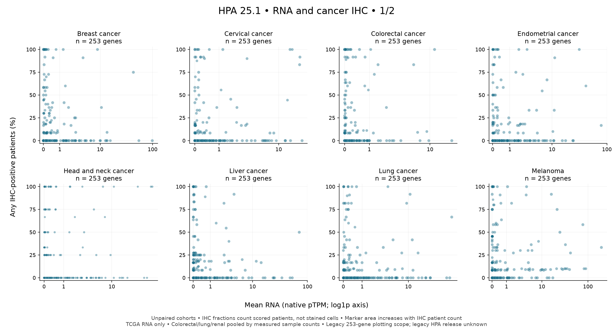
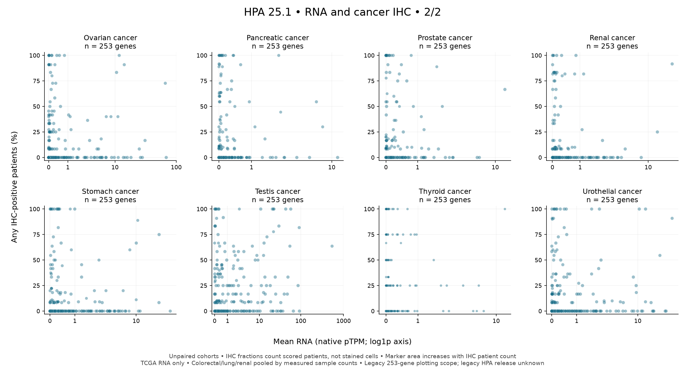
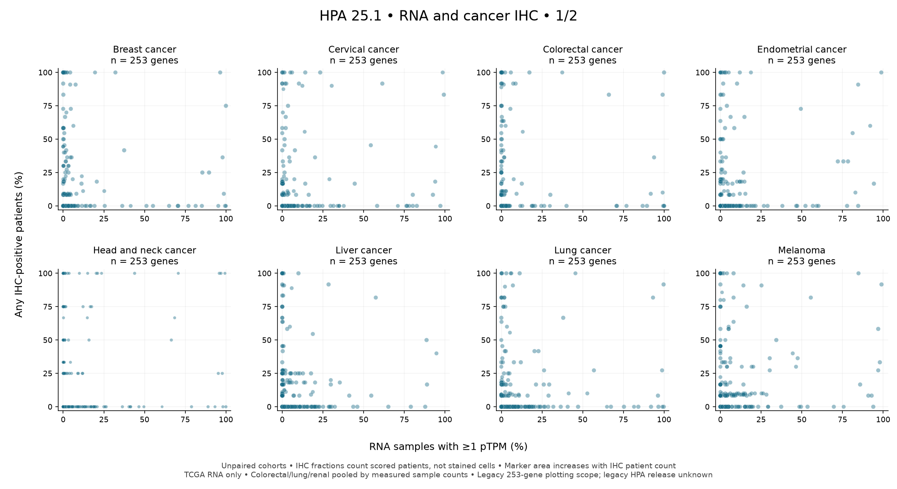
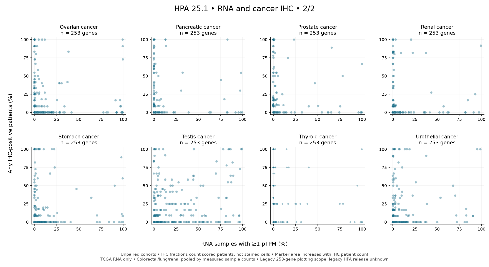
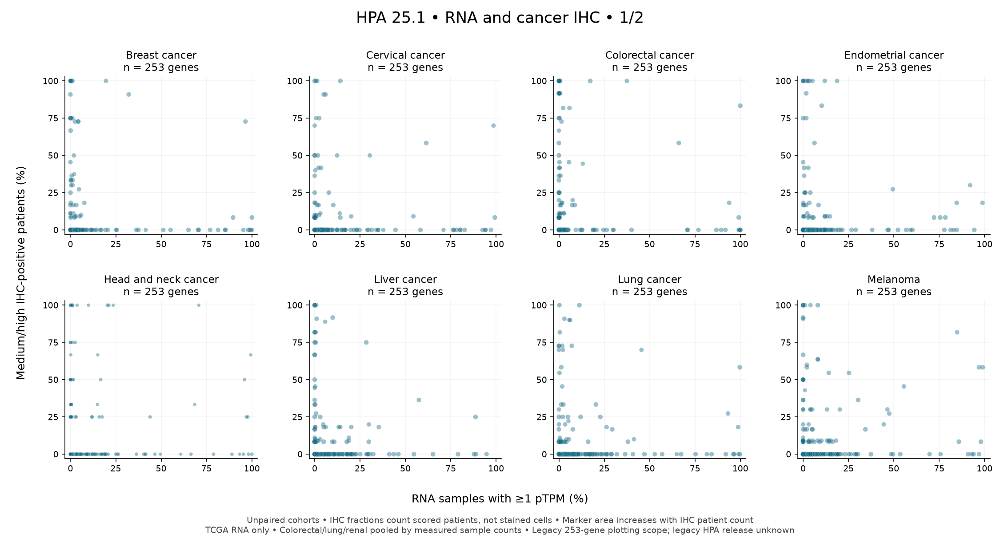
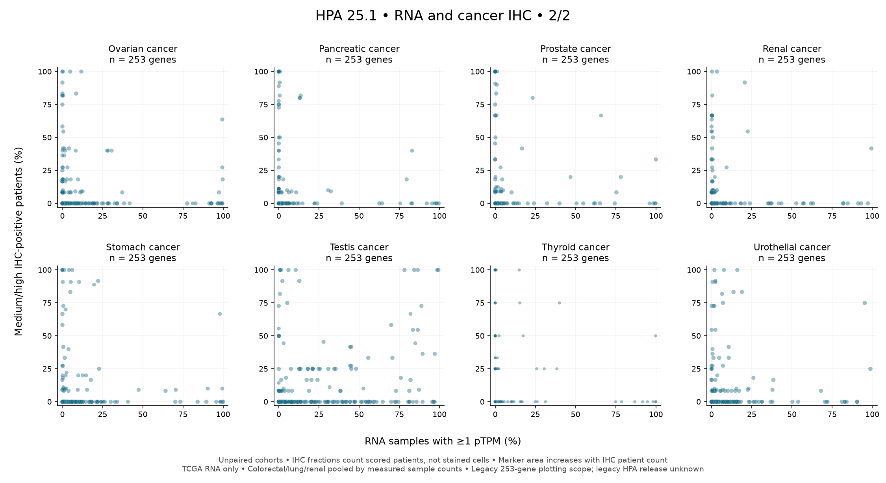

# HPA cancer RNA and IHC reference

The genome-wide cancer reference is HPA **25.1**, oncoref reference revision
**v25.1-1**, with native Ensembl **109** gene IDs. The
[HPA cancer download page](https://www.proteinatlas.org/humanproteome/cancer/data)
and [release history](https://www.proteinatlas.org/about/releases) identify this
release. Archived copies of those pages accompany the raw files. Individual
file modification dates are not treated as release identifiers. The existing
normal-tissue reference remains independently pinned to HPA v23.

| Reference | Scope | Rows |
| --- | --- | ---: |
| Cancer IHC | 15,312 genes; 20 cancer groups | 306,237 gene/group rows |
| Cancer RNA | 19,973 genes; 21 TCGA and 10 validation cancer types | 610,303 gene/type/cohort rows |
| Raw sample RNA | 6,918 TCGA + 1,466 validation samples | 166,373,192 gene/sample measurements |

These are the full source gene universes, without a CTA filter. Not every gene
has every IHC group or validation RNA cohort. Missing rows are not invented.

## API and denominators

```python
import oncoref as od

ihc = od.hpa_cancer_ihc_prevalence()  # all source genes
rna = od.hpa_cancer_rna_prevalence(cohort="TCGA")
comparison = od.hpa_cancer_rna_ihc_comparison(["ENSG00000155622"], threshold=1)
crosswalk = od.hpa_cancer_crosswalk()
cohorts = od.hpa_cancer_rna_cohorts()
sources = od.hpa_cancer_sources()
limitations = od.hpa_cancer_assay_limitations()
```

Accessors accept one gene ID or an iterable. IDs are not remapped to oncoref's
newer canonical gene space. `hpa_gene_name` is the IHC source label; RNA-only
genes can have a missing name rather than one guessed from another release.

IHC `high`, `medium`, `low`, and `not_detected` are scored-patient counts.
`total` sums them only when all four categories are known. `detected` sums
high, medium and low; `medium_high` sums medium and high. Prevalence divides
these counts by a positive `total`. Missing categories give missing fractions;
zero denominators remain `no_scored_patients`. Measured zero numerators give
genuine zero fractions. Fractions do **not** measure stained cells within tumors.

RNA remains in native **pTPM**, without clean-TPM normalization. `samples`
counts finite measurements; `missing_samples` counts explicit missing values;
`source_samples` counts their union; `nominal_samples` records source cohort
size. Summaries retain `sum_ptpm`, `mean_ptpm`, `max_ptpm`, and positive counts
and fractions at **≥0.1, ≥1, ≥2 and ≥5 pTPM**. Missing measurements are excluded
from denominators. Absent gene/cohort rows are not all-negative observations.
This acquisition has no explicit missing measurements, but absent validation
gene/cohort rows do occur.

TCGA and validation always occupy separate rows. `cohort=None` returns both
without pooling. The comparison accessor requires one cohort.

## Cancer correspondence

The checked-in crosswalk covers all 20 IHC groups and every source RNA code.

| IHC group | Required RNA codes | Treatment |
| --- | --- | --- |
| Colorectal cancer | COAD + READ | Pool sample counts, positive counts and pTPM sums |
| Lung cancer | LUAD + LUSC | Same weighted pooling |
| Renal cancer | KICH + KIRC + KIRP | Same weighted pooling |
| Glioma | GBM only in RNA | `scope_mismatch`; no comparison RNA values |
| Carcinoid, lymphoma, skin cancer | None | `unmatched`; no comparison RNA values |
| Remaining 13 IHC groups | One RNA type each | Anatomical correspondence |

Every required RNA type must have measured samples for that gene. Validation
KIRC alone cannot stand in for the renal group. Incomplete pools retain
available/required type counts and `incomplete_rna_types`, with missing pooled
RNA values. Means are `sum(sum_ptpm) / sum(samples)` and fractions are
`sum(positive_samples) / sum(samples)`, never unweighted averages of type values.

Anatomical correspondence does not establish identical histologies or patient
composition. Every comparison has `cohorts_paired=False`. These descriptive
summaries are not matched RNA/protein calibration or individual-tumor protein
predictions.

## Antibody and legacy limitations

The aggregate IHC table has no antibody identifiers or reliability fields.
It cannot establish reagent specificity, distinguish paralog cross-reactivity,
or adjudicate RNA disagreement. The separate limitations accessor exposes
this absence and existing gene-specific normal-tissue curation cautions.
Those cautions are **not cancer assay revalidation**; they neither alter counts
nor automatically exclude genes.

The legacy tsarina caches have 5,060 IHC and 10,661 RNA rows. Their HPA release
was not recorded. Their hashes and generator commit remain in
`hpa_cancer_sources()["legacy_tsarina"]`, with `hpa_release=None`. The fresh
acquisition's 25.1 label is never assigned retrospectively to those caches.

## Downloads and reproduction

The [archived reference release](https://github.com/pirl-unc/oncoref/releases/tag/hpa-cancer-v25.1-1)
contains raw downloads, acquisition records, provider release evidence, the
derived RNA summary and build audit. Package metadata pins archive and
extracted-content hashes. Downloads are checked before atomic promotion; reuse
checks the package content pin even for unrecorded cache files. Invalid bytes
cannot replace a good cached file.

```python
from oncoref import catalog, reference_data

catalog.ensure("hpa_cancer_ihc")       # small raw IHC table
catalog.ensure("hpa_cancer_rna")       # precomputed RNA summary
reference_data.verify("hpa_cancer_rna")
# Optional reproduction input, not needed by the prevalence APIs:
catalog.ensure("hpa_cancer_rna_samples")  # approximately 1.36 GB; stays gzipped
```

Caches use `CANCERDATA_DATA_DIR/sources` or `~/.cache/oncoref/sources`, with
independent source/version directories. `oncoref data fetch hpa` includes the
large sample input; the prevalence APIs only fetch their compact references.

Download the seven files named in `hpa_cancer_sources()["raw_sources"]` from
their `archive_url` into a source directory. Then run:

```bash
python scripts/build_hpa_cancer_reference.py \
  --sources /path/to/hpa-cancer-sources --output /path/to/rebuild
python scripts/plot_hpa_cancer_comparison.py
```

The builder verifies raw hashes, processes complete contiguous gene blocks in
bounded memory, and rejects duplicate identities across parser chunks and
negative/nonfinite nonmissing measurements. ZIP metadata is fixed. Derived
hashes are recorded in the package source manifest and
[build audit](audits/hpa-cancer/build-audit.json).

The plots preserve the checked-in legacy 253-gene plotting scope while the
reference remains genome-wide. They contain 4,048 comparable gene/group rows,
253 glioma scope mismatches and 759 unmatched rows. The
[plot audit](audits/hpa-cancer/figures/plot-audit.json) and
[comparison table](audits/hpa-cancer/figures/comparison.csv) retain those outcomes.








## Migrating tsarina after release

After oncoref 1.8.201 ships, replace tsarina's cached CSV loaders and generator
with these accessors. Its candidate-selection functions must explicitly select
their intended gene IDs because the new defaults are genome-wide. Join current
curated symbols by gene ID downstream; `hpa_gene_name` is a source annotation.

Existing IHC count/prevalence names and RNA threshold/count names are preserved;
new fields expose denominators and source cohorts. Use the comparison API in
place of an ad hoc crosswalk. Keep legacy cache hashes as historical provenance.
Downstream cache ownership moves in the follow-up migration after the oncoref
release is available.
